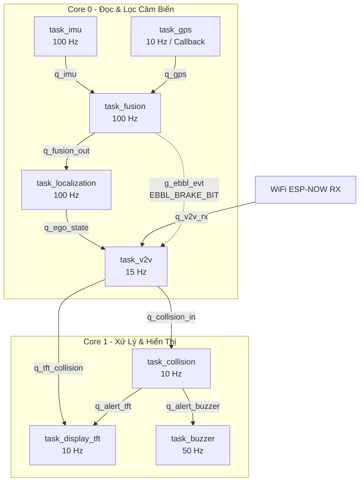

# Hệ thống Cảnh báo Va chạm V2V Phân tán (Distributed V2V Collision Warning System)

Dự án này là hệ thống cảnh báo va chạm giữa các phương tiện (Vehicle-to-Vehicle - V2V) thời gian thực, chạy trên vi điều khiển **ESP32-S3** sử dụng hệ điều hành **FreeRTOS**. Hệ thống kết hợp dữ liệu từ cảm biến quán tính **MPU6050 (IMU)** và định vị **u-blox NEO-8M (GPS)** thông qua bộ lọc bù (Complementary Filter) và thuật toán Định vị dự đoán (Dead Reckoning) tần số cao (100 Hz), truyền thông điệp cảnh báo qua giao thức không dây **ESP-NOW** tốc độ cao và hiển thị mô phỏng 3D trên màn hình **TFT ST7735**.

---

## 📌 Các Tính Năng Cốt Lõi

1. **Định vị dự đoán tần số cao (100 Hz Dead Reckoning)**:
   - Giải quyết giới hạn tần số thấp (10 Hz) và độ trễ của GPS. 
   - Tự động tích phân gia tốc và vận tốc góc từ IMU ở tần số 100 Hz.
   - Khi nhận được tín hiệu định vị mới từ GPS NEO-8M (10 Hz), hệ thống tự động reset sai số tích lũy của DR và tái tích phân các mẫu IMU trong bộ đệm vòng (Ring Buffer) để đồng bộ hóa tọa độ.
   - Chuyển đổi mượt mà tọa độ phẳng ENU (East-North-Up) sang Vĩ độ/Kinh độ (Latitude/Longitude) ở tần số 100 Hz giúp triệt tiêu hiện tượng giật giật (jitter) vị trí khi truyền nhận giữa các xe.

2. **Truyền thông V2V phân tán qua ESP-NOW**:
   - Tần số phát broadcast khoảng 15 Hz (chu kỳ 67 ms).
   - Tự động lọc gói tin phản hồi ngược (loopback) của chính mình dựa trên ID 4-byte trích xuất từ địa chỉ MAC.
   - Cơ chế tự động xóa các xe lân cận khỏi bảng theo dõi (Eviction) nếu quá 1 giây (`CFG_PKT_STALE_MS = 1000`) không nhận được gói tin mới.

3. **Cảnh báo phanh khẩn cấp EBBL (Emergency Electronic Brake Light)**:
   - Khi phát hiện xe mình phanh gấp (Gia tốc âm dọc thân xe vượt ngưỡng `CFG_EBBL_BRAKE_MS2 = -2.5 m/s²` liên tiếp 3 mẫu), hệ thống lập tức chuyển sang chế độ khẩn cấp, phát **burst liên tục 3 gói tin cảnh báo nguy hiểm** cách nhau 20 ms để đảm bảo các xe phía sau nhận được ngay lập tức.

4. **Đánh giá va chạm thông minh (EBBL & TTC)**:
   - **Heading Match Filter**: Chỉ cảnh báo nếu xe phía trước di chuyển cùng chiều (lệch heading < 30°), loại bỏ cảnh báo giả từ xe ngược chiều hoặc xe đi ngang ngã tư.
   - **Dynamic Cone Filter (Bộ lọc hình nón động)**:
     - Cự ly gần (< 15 m): Mở rộng góc quét lên ±60° để tránh mất cảnh báo khi xe bị lệch làn/nhảy làn do sai số GPS.
     - Cự ly xa (>= 15 m): Thu hẹp góc quét còn ±30° để tránh cảnh báo nhầm xe ở làn bên cạnh.
   - **Time-To-Collision (TTC)**: Tính toán thời gian va chạm dựa trên khoảng cách và tốc độ tiếp cận tương đối.

5. **Giao diện trực quan ADAS 3D & Cảnh báo âm thanh**:
   - Mô phỏng đường 3D với hiệu ứng vạch kẻ đường chuyển động động theo tốc độ xe.
   - Hiển thị góc cua xe dựa trên dữ liệu vận tốc góc `gyro_z` từ IMU (hiệu ứng nghiêng cabin xe Ego và bẻ bánh xe).
   - Hiển thị xe mục tiêu phía trước thay đổi kích thước lớn/nhỏ theo khoảng cách thực tế.
   - Đèn hậu xe Ego sáng đỏ rực khi có cảnh báo.
   - Mức độ cảnh báo trực quan:
     - **CRITICAL** (TTC < 2s): Màn hình nền đỏ rực, còi buzzer kêu dồn dập (80ms ON / 80ms OFF).
     - **WARNING** (TTC < 4s): Màn hình nền cam, còi buzzer kêu vừa (150ms ON / 250ms OFF).
     - **INFO** (TTC < 6s): Màn hình nền xanh lá, còi buzzer kêu chậm (200ms ON / 800ms OFF).
     - **IDLE** (An toàn): Màn hình hiển thị ADAS xanh dương, hiển thị trạng thái GPS và số lượng xe liên kết.

---

## 🛠 Sơ đồ Kết nối Phần cứng (Pinout)

Hệ thống được thiết kế tối ưu hóa cho kit phát triển **ESP32-S3**. Dưới đây là cấu hình kết nối chân mặc định trong file [config.h](file:///home/loc/Project/Final%20Bacherlor%20Project/distributed-v2v-warning-system/main/config.h):

| Thiết bị Ngoại vi | Chân ESP32-S3 | Loại Giao tiếp / Ghi chú |
| :--- | :---: | :--- |
| **GPS u-blox NEO-8M TX** | **GPIO 38** | UART1 RX |
| **GPS u-blox NEO-8M RX** | **GPIO 39** | UART1 TX (để gửi UBX cấu hình) |
| **IMU MPU6050 SDA** | **GPIO 42** | I2C0 SDA (Pull-up 4.7k Ohm) |
| **IMU MPU6050 SCL** | **GPIO 41** | I2C0 SCL (Pull-up 4.7k Ohm) |
| **TFT ST7735 MOSI** | **GPIO 35** | SPI2 MOSI |
| **TFT ST7735 SCLK** | **GPIO 36** | SPI2 SCLK |
| **TFT ST7735 CS** | **GPIO 20** | SPI2 Chip Select |
| **TFT ST7735 DC** | **GPIO 2** | Data/Command Control |
| **TFT ST7735 RST** | **GPIO 21** | Reset Pin |
| **TFT ST7735 BL** | **GPIO 37** | Backlight Control |
| **Active Buzzer** | **GPIO 19** | Output High/Low điều khiển còi |

---

## 📐 Kiến trúc Đa nhiệm & Pipeline Dữ liệu (FreeRTOS)

Hệ thống được thiết kế theo mô hình kiến trúc Pipeline dựa trên Queue để truyền dữ liệu bất đồng bộ giữa các tác vụ (tasks), tận dụng tối đa cấu trúc 2 nhân của ESP32-S3:



### Chi tiết các Task và Queue:
1. **`task_imu` (Core 0, Prio 6, Chu kỳ 10ms)**: Đọc gia tốc và vận tốc góc thô từ MPU6050, chuyển đổi sang đơn vị chuẩn SI ($m/s^2$, $rad/s$), gửi vào `q_imu`.
2. **`task_gps` (Core 0, Prio 5, Hướng sự kiện)**: Khởi tạo module GPS NEO-8M bằng tập lệnh cấu hình nhị phân **u-blox UBX** qua cổng UART ở tốc độ 115200 baud, cài đặt tần số lấy mẫu tối đa **10 Hz** và chỉ cho phép xuất câu lệnh dữ liệu NMEA **RMC** (các câu lệnh khác như GGA, GLL, GNS, GSA, GSV, VTG đều bị tắt để tiết kiệm băng thông và giảm độ trễ xử lý). Khi có dữ liệu fix hợp lệ, callback sẽ đẩy vào `q_gps`.
3. **`task_fusion` (Core 0, Prio 4, Hướng dữ liệu)**: Nhận dữ liệu IMU để cập nhật bộ lọc bù (Complementary Filter) ước tính góc nghiêng xe (pitch, roll, heading). Fuses heading của GPS vào bộ lọc khi xe chạy tốc độ lớn hơn 1.5 m/s. Nếu gia tốc dọc giảm đột ngột dưới -2.5 m/s², kích hoạt bit sự kiện phanh gấp `EBBL_BRAKE_BIT`. Kết quả gửi vào `q_fusion_out`.
4. **`task_localization` (Core 0, Prio 4, Hướng dữ liệu)**: Thực hiện thuật toán Định vị dự đoán (Dead Reckoning). Khi có GPS fix mới từ `q_fusion_out`, reset gốc DR và thực hiện tích phân bù trễ. Chuyển đổi tọa độ ENU động thành Vĩ độ/Kinh độ trơn tru 100 Hz, cập nhật vào `q_ego_state`.
5. **`task_v2v` (Core 0, Prio 3, Chu kỳ 67ms)**: Phát gói tin trạng thái của mình qua ESP-NOW. Nếu có bit phanh gấp, phát burst liên tục 3 gói tin nguy hiểm cấp độ CRITICAL. Đồng thời nhận gói tin từ các xe xung quanh, lọc bỏ gói loopback của chính mình, cập nhật vào bảng xe lân cận (Neighbor Table) và gửi snapshot tổng hợp sang `q_collision_in` và `q_tft_collision`.
6. **`task_collision` (Core 1, Prio 3, Chu kỳ 100ms)**: Đọc dữ liệu snapshot xe, tính toán tọa độ tương đối phẳng ENU của các xe lân cận so với xe mình, bù trễ truyền thông mạng bằng ngoại suy chuyển động tuyến tính, sau đó chạy thuật toán kiểm tra EBBL/TTC. Gửi kết quả cảnh báo nguy hiểm nhất tới `q_alert_tft` và `q_alert_buzzer`.
7. **`task_display_tft` (Core 1, Prio 2, Chu kỳ 100ms)**: Nhận kết quả cảnh báo và snapshot xe, vẽ đồ họa ADAS 3D tối ưu lên màn hình TFT ST7735 bằng cơ chế Layer-based rendering (chỉ vẽ đè phần động, không vẽ lại nền tĩnh giúp tránh chớp nháy màn hình).
8. **`task_buzzer` (Core 1, Prio 3, Chu kỳ 20ms)**: Tạo các âm thanh bíp cảnh báo tương ứng với cấp độ nguy hiểm. Nhằm đảm bảo âm thanh đầy đủ và dễ nhận biết, mỗi âm báo được giữ tối thiểu 1.5 giây trước khi chuyển đổi trạng thái.

---

## ⚙️ Cấu hình Hệ thống Quan trọng (`main/config.h`)

Bạn có thể tinh chỉnh các thông số hoạt động của hệ thống tại [main/config.h](file:///home/loc/Project/Final%20Bacherlor Project/distributed-v2v-warning-system/main/config.h):

- **Thông số Định vị (NEO-8M)**:
  - `CFG_GPS_RATE_HZ`: Đặt ở `10` Hz (tốc độ lấy mẫu tối đa của chip NEO-8M).
  - `CFG_GPS_STALE_MS`: Đặt ở `500` ms (sau 5 fix bị lỡ, tín hiệu GPS sẽ bị coi là mất và chuyển hoàn toàn sang chế độ Dead Reckoning đơn thuần).
- **Thông số Hiệu chỉnh IMU**:
  - `CFG_IMU_CALIB_S`: `3` giây (khi cấp nguồn, xe cần phải đứng yên trong 3 giây để hệ thống thực hiện hiệu chỉnh bù sai số tĩnh cho MPU6050 và lưu vào bộ nhớ flash NVS).
- **Ngưỡng Cảnh báo Va chạm**:
  - `CFG_EBBL_BRAKE_MS2`: `-2.5f` ($m/s^2$) - Ngưỡng gia tốc phanh gấp để kích hoạt cảnh báo khẩn cấp EBBL.
  - `CFG_EBBL_HEADING_LIMIT`: `30.0f` (độ) - Độ lệch hướng tối đa giữa hai xe để xác nhận đi cùng chiều.
  - `CFG_EBBL_TTC_CRIT_S`: `2.0f` (giây) - Ngưỡng thời gian va chạm khẩn cấp (Cấp độ Đỏ).
  - `CFG_EBBL_TTC_WARN_S`: `4.0f` (giây) - Ngưỡng thời gian va chạm nguy hiểm (Cấp độ Cam).
  - `CFG_EBBL_TTC_INFO_S`: `6.0f` (giây) - Ngưỡng thời gian va chạm chú ý (Cấp độ Vàng).

---

## 🚀 Hướng dẫn Biên dịch và Cài đặt

Dự án sử dụng bộ công cụ phát triển chính thức **ESP-IDF** (phiên bản khuyến khuyến nghị từ `v5.0` đến `v5.3`).

### 1. Chuẩn bị môi trường
Hãy đảm bảo bạn đã cài đặt và thiết lập biến môi trường cho ESP-IDF:
```bash
. $HOME/esp/esp-idf/export.sh
```

### 2. Cấu hình dự án (Tùy chọn)
Nếu bạn muốn cấu hình các thông số hệ thống phần cứng sâu hơn (như phân vùng bảng Partition Table, cấu hình xung nhịp CPU lên 240MHz để xử lý đồ họa mượt hơn):
```bash
idf.py menuconfig
```

### 3. Biên dịch chương trình
Biên dịch toàn bộ mã nguồn của dự án:
```bash
idf.py build
```

### 4. Nạp chương trình và Theo dõi
Nạp file thực thi vào mạch ESP32-S3 và mở cổng terminal để theo dõi log debug trực tiếp:
```bash
idf.py -p <PORT_CỦA_BẠN> flash monitor
```
*(Thay thế `<PORT_CỦA_BẠN>` bằng cổng thực tế, ví dụ `/dev/ttyUSB0` trên Linux).*

### 5. Ghi chú khi khởi động hệ thống
- **Quá trình hiệu chỉnh IMU**: Ngay sau khi khởi động mạch, còi buzzer sẽ phát tiếng bíp ngắn báo hiệu bắt đầu hiệu chỉnh IMU. Hãy **giữ xe đứng yên hoàn toàn trên mặt phẳng nằm ngang trong 3 giây**. Còi kêu bíp bíp lần hai báo hiệu hiệu chỉnh thành công. Hệ thống sẽ lưu trữ các giá trị bù offset này vào phân vùng bộ nhớ NVS để tự động tải lại cho các lần khởi động sau.
- **Tín hiệu định vị**: Khi mới khởi động trong nhà, đèn báo trạng thái định vị ở chân màn hình sẽ có màu đỏ (chưa có GPS fix). Khi mang ra không gian thoáng, module NEO-8M bắt đầu nhận được tín hiệu từ các chòm sao vệ tinh (GPS, GLONASS, Galileo), trạng thái định vị trên màn hình sẽ chuyển sang màu xanh lá mượt mà.
